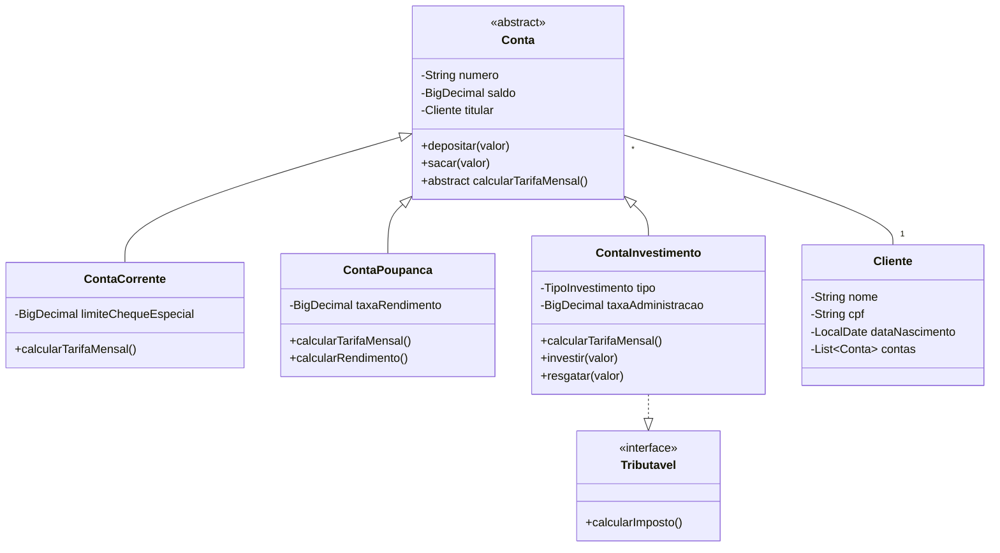

# Estrutura do Projeto

## Organização dos Pacotes

```
src/
├── com.banco
│   ├── Main.java                    // Ponto de entrada da aplicação
│   │
│   ├── domain                       // Classes de domínio
│   │   ├── Cliente.java
│   │   ├── Conta.java
│   │   ├── ContaCorrente.java
│   │   ├── ContaPoupanca.java
│   │   ├── ContaInvestimento.java
│   │   └── ContaInvestimento.java
│   │
│   ├── service                      // Regras de negócio
│   │   ├── ContaService.java
│   │   ├── TransferenciaService.java
│   │   └── InvestimentoService.java
│   │
│   ├── repository                   // Acesso a dados
│   │   ├── ClienteRepository.java
│   │   └── ContaRepository.java
│   │
│   ├── exception                    // Exceções personalizadas
│   │   ├── BancoException.java
│   │   ├── ContaNaoEncontradaException.java
│   │   └── SaldoInsuficienteException.java
│   │
│   └── util                         // Classes utilitárias
│       ├── ValidadorCPF.java
│       └── FormatadorMonetario.java
```

## Diagrama de Classes



## Padrões Utilizados

### 1. Repository Pattern

```java
public interface ContaRepository {
    Optional<Conta> findByNumero(String numero);
    List<Conta> findByTitular(Cliente titular);
    void save(Conta conta);
    void delete(Conta conta);
}

@Repository
public class ContaRepositoryImpl implements ContaRepository {
    private Map<String, Conta> contas = new HashMap<>();

    @Override
    public Optional<Conta> findByNumero(String numero) {
        return Optional.ofNullable(contas.get(numero));
    }

    // outras implementações
}
```

### 2. Service Pattern

```java
@Service
public class TransferenciaService {
    private final ContaRepository contaRepository;
    private final Logger logger;

    public TransferenciaService(ContaRepository contaRepository) {
        this.contaRepository = contaRepository;
        this.logger = LoggerFactory.getLogger(TransferenciaService.class);
    }

    @Transactional
    public void transferir(String numeroOrigem, String numeroDestino, BigDecimal valor) {
        // implementação
    }
}
```

### 3. Factory Pattern

```java
public class ContaFactory {
    public static Conta criarConta(TipoConta tipo, Cliente titular) {
        switch (tipo) {
            case CORRENTE:
                return new ContaCorrente(titular);
            case POUPANCA:
                return new ContaPoupanca(titular);
            case INVESTIMENTO:
                return new ContaInvestimento(titular);
            default:
                throw new IllegalArgumentException("Tipo de conta inválido");
        }
    }
}
```

### 4. Builder Pattern

```java
public class ClienteBuilder {
    private String nome;
    private String cpf;
    private LocalDate dataNascimento;

    public ClienteBuilder comNome(String nome) {
        this.nome = nome;
        return this;
    }

    public ClienteBuilder comCPF(String cpf) {
        this.cpf = cpf;
        return this;
    }

    public ClienteBuilder comDataNascimento(LocalDate data) {
        this.dataNascimento = data;
        return this;
    }

    public Cliente build() {
        // Validações
        if (nome == null || cpf == null) {
            throw new IllegalStateException("Nome e CPF são obrigatórios");
        }

        return new Cliente(nome, cpf, dataNascimento);
    }
}
```

### 5. Strategy Pattern

```java
public interface CalculadoraTarifa {
    BigDecimal calcular(Conta conta);
}

public class TarifaContaCorrente implements CalculadoraTarifa {
    @Override
    public BigDecimal calcular(Conta conta) {
        return new BigDecimal("30.00");
    }
}

public class TarifaContaPoupanca implements CalculadoraTarifa {
    @Override
    public BigDecimal calcular(Conta conta) {
        return BigDecimal.ZERO;
    }
}
```

## Princípios SOLID Aplicados

1. **Single Responsibility Principle (SRP)**

   - Cada classe tem uma única responsabilidade
   - Exemplo: `ContaRepository` lida apenas com persistência

2. **Open/Closed Principle (OCP)**

   - Classes abertas para extensão, fechadas para modificação
   - Exemplo: Nova conta pode ser criada estendendo `Conta`

3. **Liskov Substitution Principle (LSP)**

   - Subtipos podem substituir seus tipos base
   - Exemplo: `ContaCorrente` pode ser usado onde `Conta` é esperada

4. **Interface Segregation Principle (ISP)**

   - Interfaces específicas são melhores que uma geral
   - Exemplo: `Tributavel` tem apenas métodos relevantes

5. **Dependency Inversion Principle (DIP)**
   - Dependa de abstrações, não implementações
   - Exemplo: Serviços dependem de interfaces Repository

## Boas Práticas de Código

1. **Nomenclatura Clara**

   - Classes: substantivos (Cliente, Conta)
   - Métodos: verbos (depositar, sacar)
   - Variáveis: descritivas (saldoAtual, numeroContaOrigem)

2. **Comentários e Documentação**

   - JavaDoc em classes e métodos públicos
   - Comentários explicando lógicas complexas

3. **Tratamento de Erros**

   - Exceções específicas para cada caso
   - Logging apropriado
   - Validações de entrada

4. **Testes**

   - Unitários para regras de negócio
   - Integração para fluxos completos
   - Cobertura adequada

5. **Clean Code**
   - Métodos pequenos e focados
   - Evitar duplicação de código
   - Código autoexplicativo
