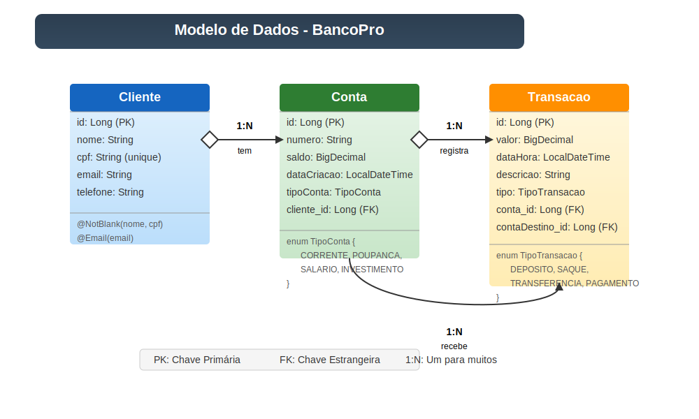
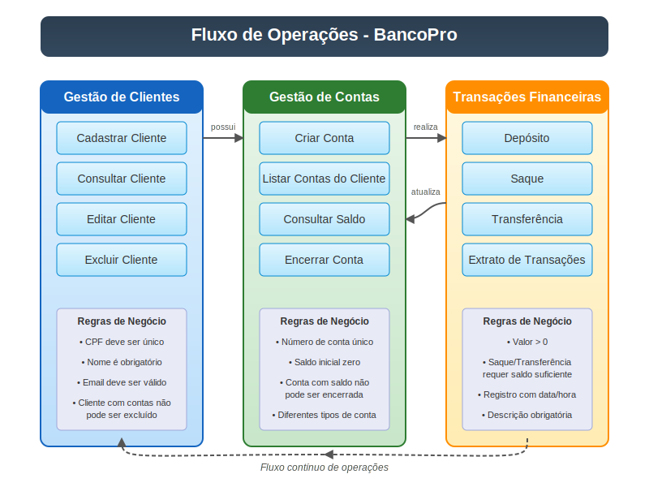

# BancoPro - Sistema de Gerenciamento Bancário

<p align="center">
  
</p>

## 📋 Sobre o Projeto

O BancoPro é um sistema de gerenciamento bancário desenvolvido com Spring Boot, que simula operações básicas de um banco digital, permitindo cadastro de clientes, gerenciamento de contas e realização de transações financeiras como depósitos, saques e transferências.

## 🚀 Tecnologias Utilizadas

- **Java 17**
- **Spring Boot 3.1.5**
- **Spring Data JPA**
- **Hibernate**
- **Thymeleaf**
- **Banco de Dados H2 (em memória)**
- **Lombok**
- **Maven**

## 🏗️ Arquitetura do Sistema

O BancoPro segue a arquitetura MVC (Model-View-Controller) com uma estrutura em camadas bem definida:

<p align="center">
  
</p>

### Camadas da Aplicação

- **Controller**: Recebe as requisições HTTP e coordena a resposta da aplicação
- **Service**: Contém a lógica de negócio da aplicação
- **Repository**: Acessa o banco de dados e realiza operações CRUD
- **Model**: Define as entidades que representam os dados da aplicação
- **View**: Templates Thymeleaf para renderização das páginas HTML

## 📊 Modelo de Dados

O sistema é composto por três entidades principais:

<p align="center">
  
</p>

### Entidades

- **Cliente**: Armazena informações dos clientes do banco
- **Conta**: Representa as contas bancárias associadas aos clientes
- **Transação**: Registra todas as operações financeiras realizadas nas contas

### Relacionamentos

- Um **Cliente** pode ter múltiplas **Contas** (1:N)
- Uma **Conta** pode ter múltiplas **Transações** (1:N)
- Uma **Transação** pode envolver duas **Contas** no caso de transferências

## 🔄 Fluxo de Operações

<p align="center">
  
</p>

### Principais Operações

1. **Cadastro e Gerenciamento de Clientes**

   - Cadastro de novos clientes com validação de CPF
   - Edição de informações de clientes
   - Exclusão de clientes (apenas se não possuírem contas ativas)

2. **Gerenciamento de Contas**

   - Criação de contas de diferentes tipos (Corrente, Poupança, Salário, Investimento)
   - Consulta de saldo e extrato
   - Encerramento de contas

3. **Transações Financeiras**
   - Depósitos
   - Saques (com validação de saldo)
   - Transferências entre contas

## 🔒 Regras de Negócio

- CPF deve ser único no sistema
- Não é permitido excluir clientes com contas ativas
- Não é permitido sacar valores maiores que o saldo disponível
- Transações são registradas com data/hora, valor e descrição
- Transferências são registradas tanto na conta de origem quanto na de destino

## 🌐 Endpoints da API

### Clientes

- `GET /clientes` - Lista todos os clientes
- `GET /clientes/novo` - Formulário para novo cliente
- `POST /clientes/salvar` - Salva um cliente
- `GET /clientes/editar/{id}` - Edita um cliente existente
- `GET /clientes/excluir/{id}` - Remove um cliente

### Contas

- `GET /contas` - Lista todas as contas
- `GET /contas/cliente/{clienteId}` - Lista contas de um cliente
- `GET /contas/nova/{clienteId}` - Formulário para nova conta
- `POST /contas/criar` - Cria uma nova conta
- `GET /contas/detalhes/{id}` - Mostra detalhes da conta
- `GET /contas/encerrar/{id}` - Encerra uma conta

### Transações

- `GET /transacoes/conta/{contaId}` - Lista transações de uma conta
- `GET /transacoes/deposito/{contaId}` - Formulário de depósito
- `POST /transacoes/depositar` - Realiza um depósito
- `GET /transacoes/saque/{contaId}` - Formulário de saque
- `POST /transacoes/sacar` - Realiza um saque
- `GET /transacoes/transferencia/{contaId}` - Formulário de transferência
- `POST /transacoes/transferir` - Realiza uma transferência

## 📊 Diagrama de Classes

<p align="center">
  
</p>

## 🎨 Documentação Visual

Todos os diagramas SVG incluídos neste projeto foram otimizados com fundo branco para melhor visualização em diferentes contextos (GitHub, documentação, apresentações). Os diagramas incluem:

- **Logo do BancoPro**: Identidade visual do sistema
- **Diagrama de Arquitetura**: Estrutura em camadas MVC
- **Modelo de Dados**: Entidades e relacionamentos
- **Fluxo de Operações**: Processos do sistema
- **Diagrama de Classes**: Estrutura das classes Java

## ⚙️ Como Executar o Projeto

### Pré-requisitos

- Java 21 ou superior
- Maven

### Passos para Execução

1. Clone o repositório

   ```bash
   git clone https://github.com/seu-usuario/bancopro.git
   cd bancopro
   ```

2. Compile e execute o projeto

   ```bash
   mvn clean install
   mvn spring-boot:run
   ```

3. Acesse a aplicação

   ```
   http://localhost:8081
   ```

4. Acesse o console H2 (banco de dados)
   ```
   http://localhost:8081/h2-console
   ```
   - JDBC URL: `jdbc:h2:mem:bancoprodb`
   - Usuário: `sa`
   - Senha: (vazio)

## 🧪 Testes

Para executar os testes automatizados:

```bash
mvn test
```

## 📱 Interface do Usuário

O sistema possui interfaces intuitivas e responsivas desenvolvidas com Thymeleaf e Bootstrap, incluindo:

- **Tela de Clientes**: Cadastro e gerenciamento de clientes
- **Tela de Contas**: Visualização e operações em contas bancárias
- **Tela de Transações**: Realização de operações financeiras e visualização de extrato

O design é limpo e moderno, priorizando a usabilidade e a experiência do usuário.

## 🔄 Futuras Melhorias

- Implementação de autenticação e autorização com Spring Security
- Adição de mais tipos de contas e operações financeiras
- Criação de uma API REST para integração com aplicações mobile
- Implementação de relatórios e dashboards
- Migração para um banco de dados persistente (PostgreSQL/MySQL)

## 📄 Licença

Este projeto está sob a licença MIT. Veja o arquivo [LICENSE](LICENSE) para mais detalhes.

## 👨‍💻 Autor

Desenvolvido por [Seu Nome](https://github.com/seu-usuario)

---

<p align="center">
  <a href="https://www.linkedin.com/in/seu-linkedin/" target="_blank">
    
  </a>
</p>
